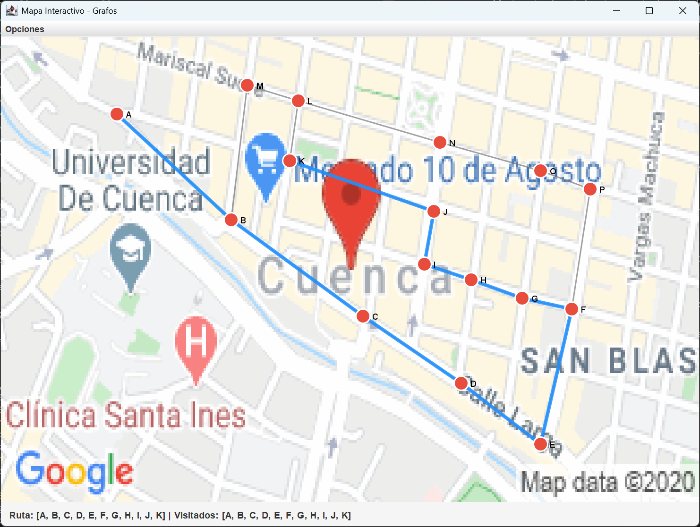
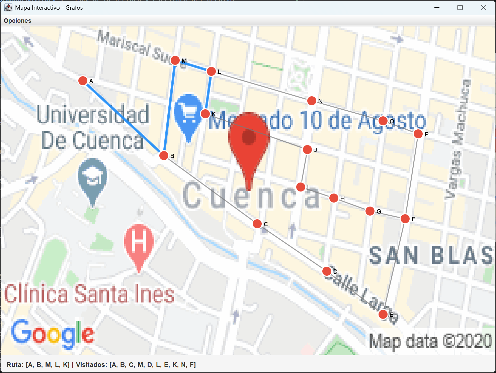
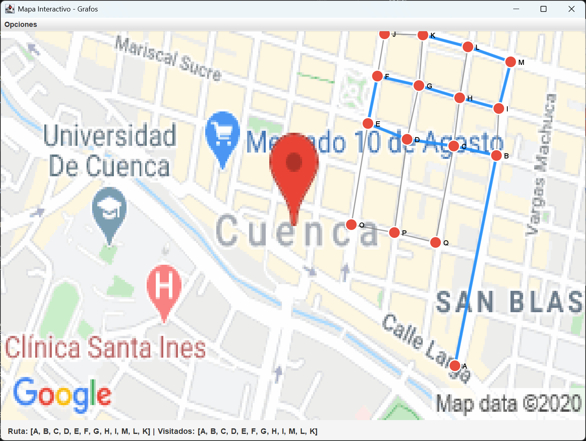
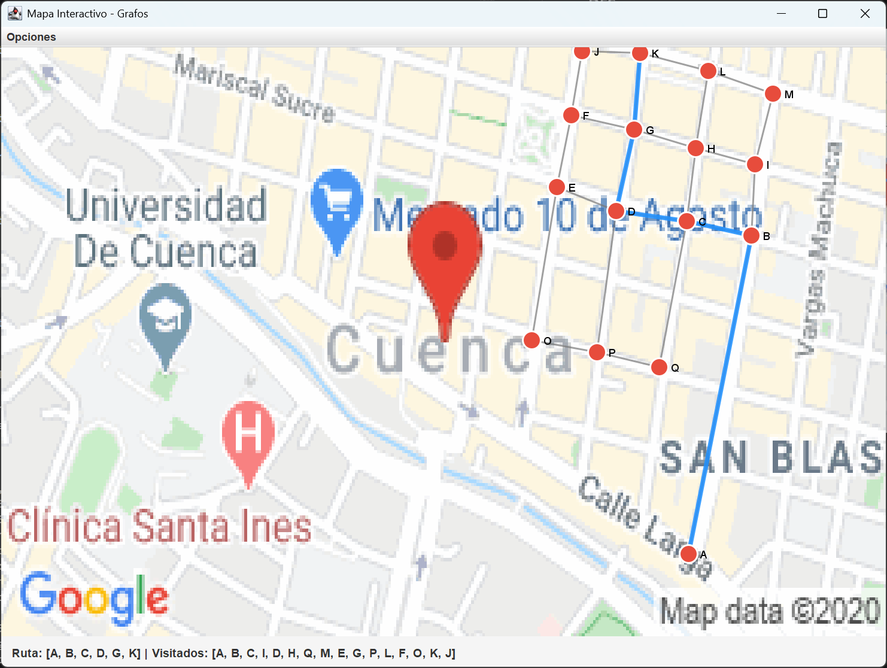
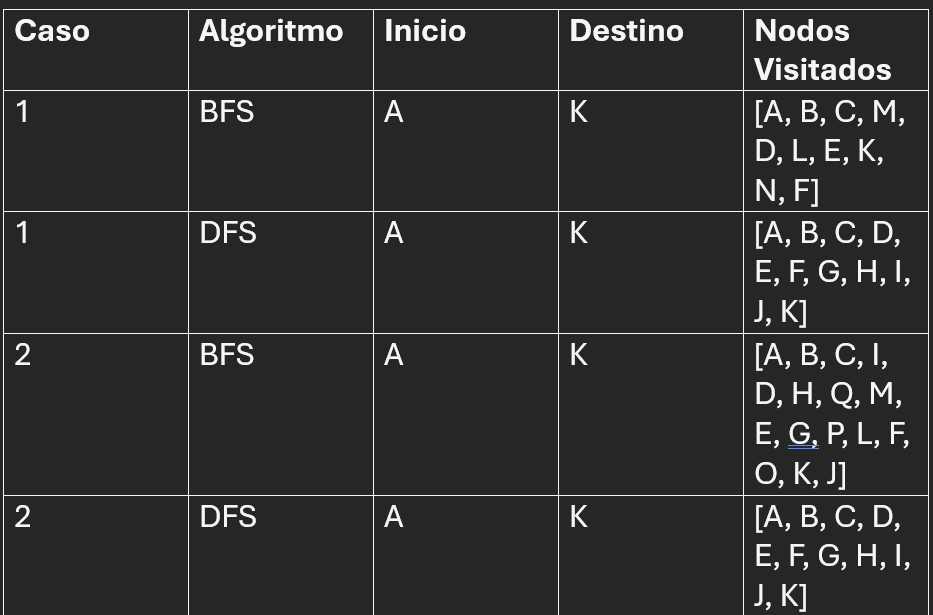

# PROYECTO FINAL - ESTRUCTURAS DE DATOS


## Asignatura: Estructura de datos

## Integrantes

- Josue Calle
- ccallei@est.ups.edu.ec

- Sebastián Pillco
- gpillcoq@est.ups.edu.ec

- Jordan Sagbay
- csagbayv@est.ups.edu.ec
---


## Aplicación Interactiva de Grafos con Algoritmos BFS y DFS
---

## Descripción del Proyecto

Este proyecto consiste en el desarrollo de una aplicación gráfica interactiva para la creación, visualización y recorrido de grafos utilizando el lenguaje de programación Java.

La aplicación permite al usuario construir un grafo sobre un mapa visual, agregar nodos, conectar nodos mediante aristas dirigidas o bidireccionales y realizar búsquedas utilizando los algoritmos BFS (Breadth-First Search) y DFS (Depth-First Search).

El objetivo principal es aplicar los conocimientos adquiridos en la asignatura de Estructuras de Datos, especialmente en el manejo de grafos, nodos, recorridos, interfaces, programación genérica y arquitectura organizada por paquetes.

---

## Objetivos

### Objetivo General

Desarrollar una aplicación interactiva basada en grafos que permita representar nodos y conexiones sobre un mapa, aplicando algoritmos de búsqueda en amplitud y búsqueda en profundidad.

### Objetivos Específicos

- Implementar una estructura de datos de tipo grafo utilizando Java.
- Permitir la creación de nodos de forma interactiva sobre un mapa.
- Implementar aristas unidireccionales.
- Implementar aristas bidireccionales.
- Aplicar el algoritmo BFS para realizar búsquedas en amplitud.
- Aplicar el algoritmo DFS para realizar búsquedas en profundidad.
- Mostrar visualmente la ruta encontrada entre dos nodos.
- Mostrar los nodos visitados durante la búsqueda.
- Permitir eliminar nodos del mapa.
- Implementar una estructura de persistencia para guardar y cargar grafos desde archivos.
- Aplicar programación genérica mediante el uso de clases parametrizadas.

## Marco Teórico

### 1. Grafos
Un Grafo es una estructura de datos no lineal compuesta por un conjunto de vértices o nodos (V) y un conjunto de aristas o conexiones (E). 
* **Dirigido vs No Dirigido:** En este proyecto se implementaron aristas unidireccionales (dirigidas) y bidireccionales (no dirigidas).
* Representación: Se utilizó una Lista de Adyacencia estructurada mediante `LinkedHashMap<Node<T>, Set<Node<T>>>` para garantizar un orden de inserción determinista y evitar discrepancias en las iteraciones.

### 2. Búsqueda en Amplitud (BFS - Breadth-First Search)
* **Mecanismo:** Explora el grafo nivel por nivel desde el nodo de origen utilizando una estructura **Cola FIFO (`Queue`)**.
* **Propiedad clave:** En grafos no ponderados, garantiza encontrar el **camino con el menor número de aristas**.

### 3. Búsqueda en Profundidad (DFS - Depth-First Search)
* **Mecanismo:** Explora lo más profundo posible a lo largo de cada rama antes de retroceder (*backtracking*), utilizando una estructura **Pila LIFO (`Stack`)** o recursión.
* **Propiedad clave:** Útil para verificar conectividad o explorar laberintos completos. No garantiza el camino más corto.

---

## Tecnologías Utilizadas

- Java
- Java Swing
- Java AWT
- Programación Orientada a Objetos
- Estructuras de Datos
- Grafos
- BFS (Breadth-First Search)
- DFS (Depth-First Search)
- Java Generics
- Manejo de archivos
- Arquitectura basada en separación de responsabilidades

---

## Diagrama UML y Explicación

* **`Node<T>`:** Modelo del nodo genérico con métodos `equals` y `hashCode` para unicidad.
* **`Graph<T>`:** Administra la lista de adyacencia y las operaciones de inserción/consulta.
* **`MapController`:** Actúa como mediador entre la vista (`MainFrame`, `MapPanl`) y la lógica de estructuras.
* **`FileGraphRepository`:** Maneja la lectura y escritura del archivo `.txt` para la persistencia.

---

## Configuracion de Mapa 1

### DFS



### BFS



## Configuracion de Mapa 2

### DFS



### BFS



## Ejemplo Algoritmo BFS

public class BFSPathFinder<T> {

    public List<Node<T>> findPath(Graph<T> graph, T start, T end) {
        Queue<Node<T>> queue = new LinkedList<>();
        Set<Node<T>> visited = new HashSet<>();
        Map<Node<T>, Node<T>> parentMap = new HashMap<>();

        Node<T> startNode = new Node<>(start);
        Node<T> endNode = new Node<>(end);

        queue.add(startNode);
        visited.add(startNode);

        while (!queue.isEmpty()) {
            Node<T> current = queue.poll();

            if (current.equals(endNode)) {
                List<Node<T>> path = new ArrayList<>();
                Node<T> curr = endNode;
                while (curr != null) {
                    path.add(0, curr);
                    curr = parentMap.get(curr);
                }
                return path;
            }

            for (Node<T> neighbor : graph.getVecinos(current.getValue())) {
                if (!visited.contains(neighbor)) {
                    visited.add(neighbor);
                    parentMap.put(neighbor, current);
                    queue.add(neighbor);
                }
            }
        }

        return Collections.emptyList();
    }
}

### Explicacion 

El algoritmo usa una cola FIFO y un conjunto de visitados para explorar el grafo nivel por nivel sin caer en bucles. Guarda en un mapa quién descubrió a cada nodo para registrar el rastro. Al llegar al destino, recorre ese mapa hacia atrás para reconstruir y devolver la ruta de inicio a fin.

## Tabla Comparativa



## Estructura del Proyecto

```text
PROYECTOFINALESTRUCTURA
│
├── resources
│   └── maps
│       └── a.java
│
├── src
│   │
│   ├── controllers
│   │   ├── BFSPathFinder.java
│   │   ├── DFSPathFinder.java
│   │   └── MapController.java
│   │
│   ├── models
│   │   ├── MapPoint.java
│   │   └── VisualizationMode.java
│   │
│   ├── persistence
│   │   ├── FileGraphRepository.java
│   │   └── GraphRepository.java
│   │
│   ├── structures
│   │   │
│   │   ├── graphs
│   │   │   ├── Graph.java
│   │   │   ├── PathFinder.java
│   │   │   └── PathResult.java
│   │   │
│   │   └── node
│   │       └── Node.java
│   │
│   ├── views
│   │   ├── MainFrame.java
│   │   └── MapPanl.java
│   │
│   └── App.java
│
├── map.png
└── README.md
```
## Conclusiones

### Sebastian Pillco: 
Con este proyecto pudimos ver como al transformar un mapa visual en puntos y conexiones nos ayuda a comprender los sistemas de navegacion que utilizamos a diario y a su vez implementar el conocimiento para resolver un problema real
### Jordan Sagbay:

Demostramos que las estructuras de datos no son solo teoría, sino la base fundamental para crear aplicaciones útiles como navegadores GPS o simuladores de tráfico.

### Josue Calle: 
Comprobamos visualmente cómo dos formas distintas de buscar (BFS y DFS) pueden encontrar caminos diferentes para llegar al mismo destino.6